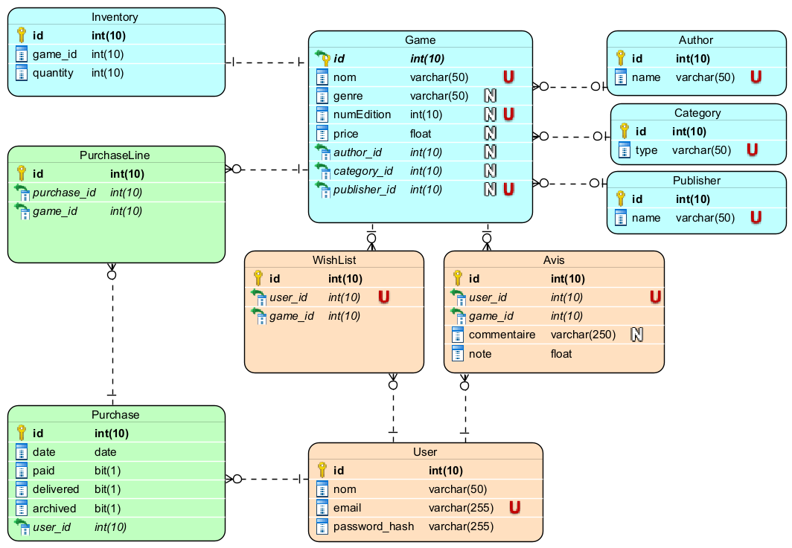

# Games Up

## Architecture
L’architecture est la suivante:


### Base de données
La base de données utilisée est MySQL. (une base in memory H2 est utilisé pour les tests et la phase de développement)

Le modèle de la base de données est le suivant :



## Evolutions / mise en conformité

- Correction du modèle de données
- Mise en place des relations entre les entités
- Mise à jour / création des controlleurs
- Création des couches manquantes : service, repository, dao
- Gestion des exceptions
- Création des tests unitaires
- Création des tests d'intégration
- Mise en place de la sécurité (spring security)
- Mise en place de données de test (incluant les comptes de test)
- Création d'un profil 'dev' avec base de donnée H2 autoprovisionnée pour les tests et la phase de développement
- Mise en place d'une documentation dynamique OpenAPI au format Swagger

## Documentation

### Swagger UI

- Une documentation dynamique OpenAPI au format Swagger est disponible à l'adresse suivante, une fois l'application démarrée sur votre poste : `http://localhost:8080/swagger-ui.html`

## Procédure de build / validation

- Pour déclencher un build en local, il suffit de lancer la commande suivante à la racine du projet:

```bash
docker-compose up
```

- Lancement des tests d'intégration : voir le fichier README.md dans le dossier integration_tests

## Liens utiles

### Sources et livrables
- [Github repository](https://github.com/aubertaa/gamesUp/)
- Artifacts de tests
  - Le rapport jacoco de couverture des tests unitaires est disponible dans le dossier https://github.com/aubertaa/gamesUp/tree/master/unit-tests-reports
  - Les rapports de test d'intégration sont disponibles dans le dossier https://github.com/aubertaa/gamesUp/tree/master/integration_tests/

### Accès à l'application
- [Swagger UI](http://localhost:8080/swagger-ui.html)


